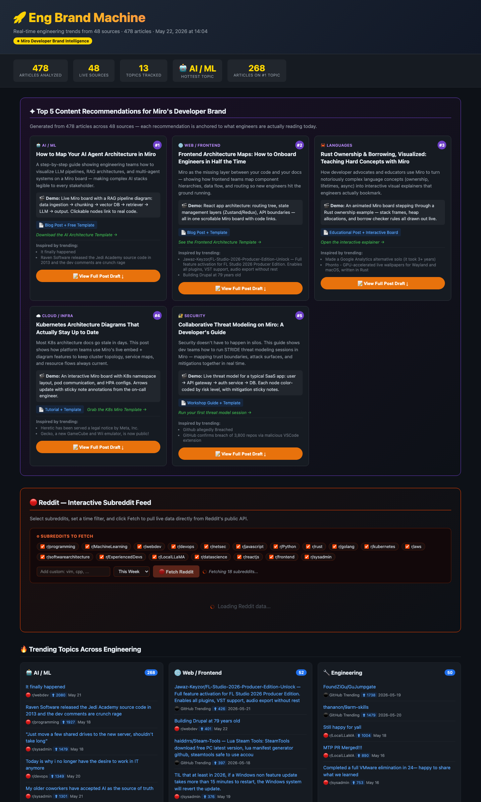

# Eng Brand Machine

### [→ View the live dashboard](https://horeaporutiu.github.io/eng-brand-machine/)

> Real-time engineering trends + automatic Miro content recommendations, in a single self-hosted dashboard.

**Eng Brand Machine** scrapes ~50 of the highest-signal sources in software engineering — Hacker News, GitHub Trending, dev.to, Reddit, and 30+ engineering blogs / newsletters — classifies every story into a topic, and then turns the *actual* trending topics of the week into ready-to-publish blog post drafts pitched at Miro's developer audience.

It's a static-site generator: one Python file in, one fully self-contained `index.html` out. No backend, no database, no API keys.



---

## Why it's interesting

Most "trend dashboards" stop at *"here are the top links."* This one closes the loop:

1. **Aggregates** ~478 articles from 48+ sources in one run (~50s).
2. **Classifies** every article into one of 13 engineering topics (AI/ML, Cloud/Infra, Security, Rust, Web/Frontend, etc.) via keyword scoring.
3. **Recommends** the top 5 Miro-developer-brand content ideas, ranked by what's *actually* trending right now.
4. **Drafts** the full blog post for each recommendation — title, hero-image prompt, SEO description, tags, body copy, and CTA — all in one click. Anchored to real trending headlines so the drafts feel *of-the-moment*.
5. **Location-aware event tracker.** A built-in conference slate can spotlight upcoming events for a target city — the current demo ships with fictional Amsterdam AI conferences for the rest of the year. The slate lives in [`data/conferences.json`](data/conferences.json) so editors don't have to touch Python.
6. **AI Conference Pulse.** Scans every article in the run for mentions of real-world AI conferences (NeurIPS, ICLR, ICML, CVPR, KDD, AWS re:Invent, GitHub Universe, KubeCon, …) and surfaces what the AI conference circuit is talking about *today* — no extra fetches, just the existing article pool.
7. **Live Reddit panel** runs entirely client-side: pick subreddits, set a time window, fetch fresh top posts without rebuilding.
8. **Zero infra.** The output is one HTML file. Open it locally, drop it on S3, or let the bundled GitHub Action publish it on a 6-hour cron.

It's a complete "developer brand intelligence" loop — input is the open web, output is publishable content briefs — in ~1,500 lines of dependency-light Python.

---

## How it works

```text
                ┌─────────────────────────────────────────┐
                │  eng_brand_machine.py                   │
                │                                         │
   HN  ──────►  │  fetch_hn_top / fetch_hn_ask_show       │
   dev.to ───►  │  fetch_devto                            │
   30+ RSS ─►   │  fetch_rss_feeds  (feedparser)          │  ──►  index.html
   GitHub ───►  │  fetch_github_trending                  │       (self-contained)
   Reddit ──►   │  fetch_reddit  (public JSON, no auth)   │
                │                                         │
                │  classify_topic → count_topics →        │
                │  generate_miro_recommendations →        │
                │  generate_html                          │
                └─────────────────────────────────────────┘
```

- **No auth required for any source** — uses public APIs, RSS, and unauthenticated JSON endpoints.
- **Topic classification** is keyword-scored against `TOPIC_KEYWORDS` in `eng_brand_machine.py`.
- **Recommendations** are picked from `MIRO_CONTENT_TEMPLATES`, ordered by which topics dominate the day's data — so the dashboard surfaces what Miro should publish about *this week*, not generic evergreen ideas.
- **The Reddit panel is interactive** — it's a small vanilla-JS app embedded in the page that calls `reddit.com/r/<sub>/top.json` from the browser.

---

## Quick start

### Prerequisites

- Python 3.10+ (tested on 3.12)
- A browser to open the output

### Install & run

```bash
git clone https://github.com/horeaporutiu/eng-brand-machine.git
cd eng-brand-machine

pip install -r requirements.txt
python3 eng_brand_machine.py

open index.html       # macOS — or just double-click the file
```

A full run takes about **45–60 seconds** (most of it RSS + Reddit fetches). When it finishes you'll see something like:

```text
📊 Total articles: 478

🏷️  Topics:
   🤖 AI / ML: 268
   🌐 Web / Frontend: 52
   🔧 Engineering: 50
   🦀 Languages: 44
   ☁️ Cloud / Infra: 17
   ...

✦ Miro Content Recommendations:
   1. [🤖 AI / ML] How to Map Your AI Agent Architecture in Miro
   2. [🌐 Web / Frontend] Frontend Architecture Maps: How to Onboard Engineers in Half the Time
   3. [🦀 Languages] Rust Ownership & Borrowing, Visualized
   4. [☁️ Cloud / Infra] Kubernetes Architecture Diagrams That Actually Stay Up to Date
   5. [🔐 Security] Collaborative Threat Modeling on Miro: A Developer's Guide

✅ Saved → index.html
```

### What you'll see in the dashboard

- **Stats bar** — total articles, live sources, topics tracked, hottest topic
- **Top 5 Miro Content Recommendations** — each with a "📝 View Full Post Draft" button that expands into a full blog draft (hero-image prompt, SEO meta, tags, body, copy-to-clipboard)
- **Amsterdam AI conference tracker** — a demo slate of fictional local events for the rest of the year, useful for campaign and event planning
- **AI Conference Pulse** — real-world AI conferences (NeurIPS, ICLR, re:Invent, …) mentioned in the day's article pool, ranked by mention count, with the top stories surfaced per conference
- **Interactive Reddit panel** — pick subreddits, choose `day / week / month / year / all`, click *Fetch Reddit*
- **Trending Topics grid** — 8 topic cards with the top stories in each bucket
- **Top 20 hottest stories** ranked across all sources
- **Source breakdown** — horizontal bars showing which feeds contributed most

---

## Using it as a daily/weekly publication

The repo includes a GitHub Action (`.github/workflows/build.yml`) that:

1. Runs every 6 hours (`cron: "0 */6 * * *"`) and on every push to `main`.
2. Lets maintainers manually dispatch the same build against any branch, then pushes the regenerated `index.html` back to that branch.
3. Installs deps, runs `python3 eng_brand_machine.py`.
4. Commits the regenerated `index.html` back to the repo with `[skip ci]`, and refreshes the matching PR description with the latest branch-build status when a PR exists.

To publish:

1. Push the repo to GitHub.
2. **Settings → Pages** → deploy from `main` branch, root.
3. Your dashboard is now live and refreshes itself every 6 hours.

That's a fully automated, free, always-fresh developer-trends site with no servers to babysit.

---

## Customizing

Everything tunable lives at the top of `eng_brand_machine.py` — except the conference catalog, which is broken out into JSON so editors can update it without touching Python:

| Section | Where to edit |
| --- | --- |
| `RSS_FEEDS` | `eng_brand_machine.py` — add/remove engineering blogs and newsletters |
| `SUBREDDITS` | `eng_brand_machine.py` — subreddits the Reddit panel ships with checked |
| `TOPIC_KEYWORDS` | `eng_brand_machine.py` — topic buckets and the keywords that route into them |
| `MIRO_CONTENT_TEMPLATES` | `eng_brand_machine.py` — the blog-post templates used as recommendations |
| `DEFAULT_RECS` | `eng_brand_machine.py` — fallback recommendations when no template matches |
| Local conference slate (city + events) | [`data/conferences.json`](data/conferences.json) → `default_location` and `fictional_local_slate` |
| Conferences scanned for the AI Pulse panel | [`data/conferences.json`](data/conferences.json) → `major_ai_conferences` |

Full reference and a worked example for both conference sections live in [`docs/CONFERENCE_TRACKER.md`](docs/CONFERENCE_TRACKER.md). The matching JSON Schema is at [`data/conferences.schema.json`](data/conferences.schema.json) for editor autocomplete and validation.

The HTML template is inline in `generate_html()` — tweak CSS variables at the top of the `<style>` block to rebrand.

### Sanity-checking conference changes

```bash
# Run the conference-tracker unit tests
python3 -m unittest tests.test_conferences -v

# Print the catalog without running the full pipeline
python3 scripts/list_conferences.py --type all
python3 scripts/list_conferences.py --type local --location "Berlin, Germany"
python3 scripts/list_conferences.py --type global --format json | jq '.global[] | .name'
```

---

## Project structure

```text
eng-brand-machine/
├── eng_brand_machine.py        # Single-file generator (~1,500 lines)
├── requirements.txt            # requests, feedparser
├── index.html                  # Generated output — committed for GitHub Pages
├── screenshot.png              # Dashboard preview (this README)
├── data/
│   ├── conferences.json        # Conference catalog (local slate + global AI confs)
│   └── conferences.schema.json # JSON Schema for editor validation
├── scripts/
│   └── list_conferences.py     # CLI helper over data/conferences.json
├── tests/
│   └── test_conferences.py     # unittest coverage for the conference features
├── docs/
│   └── CONFERENCE_TRACKER.md   # How both conference sections work + how to edit
└── .github/
    ├── ISSUE_TEMPLATE/         # "Suggest an AI conference" template + config
    ├── workflows/build.yml     # 6-hourly rebuild + auto-commit
    └── agents/my-agent.agent.md
```

---

## Tech notes

- **Single-file design.** Everything is in `eng_brand_machine.py` so it can be cloned, run, and understood in one sitting. No framework, no build step.
- **Self-contained output.** `index.html` has all CSS and JS inlined — drop it anywhere static.
- **Graceful failure.** Every fetch is wrapped in try/except; one dead RSS feed or rate-limited subreddit never breaks a run.
- **Polite scraping.** Custom `User-Agent`, timeouts on every request, score-threshold filters to skip low-effort Reddit posts.

---

## Roadmap ideas

- LLM-powered topic classification (replace keyword matching)
- Per-topic sparklines showing momentum over the last 7 days
- Auto-create Miro boards via the [Miro REST API](https://developers.miro.com/reference/) for each accepted recommendation
- Slack/Discord webhook on new top trends
- Persist historical snapshots so you can diff "what changed since last run"

---

## License

MIT.
